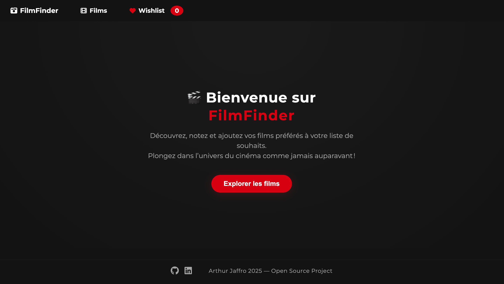
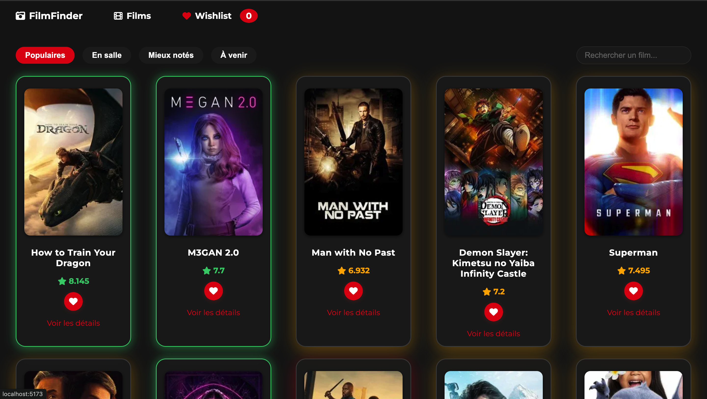
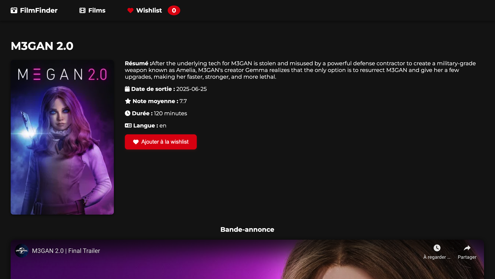

# 🎬 FilmFinder — Application de gestion de films (React + Vite)

CinéVibe est une application web moderne permettant de :
- Découvrir les films populaires, à venir, en salle ou les mieux notés grâce à l’API [TMDb](https://www.themoviedb.org/).
- Rechercher des films, consulter leurs détails, voir la bande-annonce, les acteurs principaux et des films similaires.
- Ajouter des films à une wishlist personnalisée, persistée dans le navigateur.
- Profiter d’une interface responsive, sombre, élégante et inspirée du cinéma.

---

## 🚀 Installation & Lancement

### 1. **Cloner le projet**
```bash
git clone https://github.com/ArthurJfr/tp_react_films.git
cd tp_react_films
```

### 2. **Installer les dépendances**
```bash
npm install
```

### 3. **Configurer l’API TMDb**
- Crée un compte sur [TMDb](https://www.themoviedb.org/).
- Récupère ta clé API dans ton profil (Settings > API).
- Crée un fichier `.env` à la racine du projet avec :
  ```
  VITE_API_KEY=ta_cle_tmdb
  VITE_BASE_URL=https://api.themoviedb.org/3
  ```
- La clé dans le fichier .env.example est valide

### 4. **Lancer le serveur de développement**
```bash
npm run dev
```
- L’application sera accessible sur [http://localhost:5173](http://localhost:5173) (ou le port affiché).

### 5. **Build de production**
```bash
npm run build
```
- Pour prévisualiser le build :
```bash
npm run preview
```

---

## ✨ Fonctionnalités principales

- **Accueil (Hero)** : Présentation immersive, bouton d’accès rapide à la liste des films.
- **Liste des films** : Catégories dynamiques (populaires, en salle, à venir, mieux notés), recherche avec debounce, pagination avancée.
- **Détail d’un film** : Affiche résumé, date, note, bande-annonce YouTube, acteurs principaux (avec photo), films similaires.
- **Wishlist** : Ajout/suppression de films, persistance locale, compteur en temps réel dans la navbar.
- **Design** : Glassmorphisme, dark mode, responsive mobile, favicon personnalisé.
- **Footer** : Liens vers GitHub et LinkedIn.
- **Performance** : Lazy loading des images, centralisation des appels API, code modulaire.

---

## 🛠️ Structure du projet

```
src/
  components/
    FilmCard/
    FilmNav/
    MovieList/
    MovieDetail/
    WishList/
    NavBar/
    Home/
    Footer/
  context/
    WishlistProvider.jsx
  utils/
    debounce.js
  App.jsx
  index.css
  main.jsx
public/
  favicon.svg
  ...
```

---

## 📝 Prérequis

- Node.js >= 16
- Un navigateur moderne
- Une clé API TMDb valide

---

## 📚 À propos

Ce projet est un TP complet pour apprendre à :
- Utiliser React avec Vite et la Context API
- Consommer une API REST externe (TMDb)
- Gérer le state global, le localStorage, le responsive et le design moderne
- Organiser un projet front-end de façon professionnelle

---

## 👤 Auteur

- [ArthurJfr](https://github.com/ArthurJFr)
- [Arthur JAFFRO](https://www.linkedin.com/in/ton-linkedin/)

---

## 🖼️ Aperçu

### Homepage

 

### Movies

 

### Details

  


---

## 📄 Licence

Ce projet est open-source, libre d’utilisation et d’adaptation.

---

> **N’hésite pas à forker, contribuer ou t’inspirer de ce projet pour tes propres applications React !**
